# CS 312 — Assignment 2: Hyperparameter Scaling

**Sandra Yang** (aleyang) · W&B project `aleyang-stanford-university/assignments`, tag `a2` · code: `experiments/a2/` on the `a2-experiments` branch of `github.com/birdhumming/assignments`

**Compute.** 198 new runs, ≈28 GPU-hours on H100 (budget 48). The 78 supplied source runs in `provided_sweeps.csv` were fitted, never retrained. P3.1 ran on CPU. Every prediction below was written to `p32_predictions.md` / the launcher manifests before the corresponding target run started.

**Conventions.** Loss = final validation loss (nats) of the course d8 model (8 layers, width 512, batch 64, AdamW β = (0.9, 0.95), weight decay 0.1, 1 % warmup then linear decay) unless stated. From Assignment 1 the seed-to-seed standard deviation of this model is ≈0.002, so gaps < 0.005 are noise, 0.01 is real but small, 0.1 is a different regime. "lr\*" is the optimum of a quadratic fitted in log learning rate (log LR and log WD jointly for P2); "best sampled" is the lowest measured point.

---

## Problem 1 — When can training on less data guide large-scale runs?

### (a) Small budgets (supplied runs)

| tokens | lr 0.0015 | lr 0.003 | lr 0.006 | fitted lr\* | fitted loss | curvature |
|---|---|---|---|---|---|---|
| 153.6M | 3.2442 | 3.2291 | 3.3056 | 0.00238 | 3.2240 | 0.095 |
| 307.2M | 3.0709 | 3.0562 | 3.0715 | 0.00298 | 3.0562 | 0.031 |
| 614.4M | 2.9473 | 2.9256 | 2.9408 | 0.00319 | 2.9255 | 0.038 |

Rule through the three optima: lr\* = 4.4·10⁻⁵ · D^+0.21 (R² 0.91). The optimum drifts slowly upward with budget, and the loss–LR curve flattens (curvature 0.095 → 0.038), so missing the optimum costs less as the budget grows. Figure 1, left and middle.

### (b) Predict before increasing the budget (supplied runs)

| tokens | predicted lr\* (small-3 rule) | fitted lr\* after looking | fitted loss | best sampled |
|---|---|---|---|---|
| 1.2288B | 0.00380 | 0.00388 | 2.8368 | 0.003 (2.8378) |
| 1.8432B | 0.00414 | 0.00343 | 2.7964 | 0.003 (2.7967) |
| 2.4576B | 0.00440 | 0.00291 | 2.7682 | 0.003 (2.7683) |

The trend does not continue: the optimum peaks near 1.2B tokens and turns back down, and the small-budget rule over-predicts by 20–50 % at 1.8B and 2.5B. In loss it hardly matters — lr 0.003 is the best sampled point at every budget and the curvature keeps falling (to 0.014–0.018), so being 40 % off costs ≈0.001.

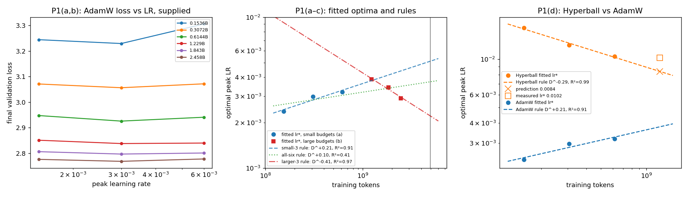
*Figure 1. Left: supplied AdamW loss–LR curves. Middle: fitted optima with the three candidate rules; vertical line = 4.9152B target. Right: Hyperball vs AdamW optima and rules, with the P1(d) prediction (×) and measured optimum (□).*

### (c) Two scaling rules tested at 4.9152B tokens (5 new runs, ≈74 min each)

| rule | law | R² | predicted lr\* at 4.9152B |
|---|---|---|---|
| all six budgets | lr\* ∝ D^+0.10 | 0.41 | 0.00373 |
| three largest budgets | lr\* ∝ D^−0.41 | 0.97 | 0.00223 |

**Prediction (before running):** the three-largest fit gives the lower loss. The small budgets are in a different regime (optimum still rising) and bias the slope; R² = 0.41 says the six-point data is not a power law.

| lr at 4.9152B | val loss | gap to best sampled |
|---|---|---|
| 0.0015 | 2.7176 | +0.0007 |
| **0.00223** (larger-three) | **2.7169** | 0 |
| 0.003 (carry over 2.5B best) | 2.7176 | +0.0007 |
| 0.00373 (all-six) | 2.7185 | +0.0017 |
| 0.006 | 2.7273 | +0.0105 |

Fitted target optimum 0.00214 (loss 2.7169). The larger-three rule landed on it; the all-six rule was 1.7× too high and cost 0.0017; simply reusing 0.003 cost 0.0007.

**Synthesis.** Small-budget tuning tells you where the flat region is, and a fit over the right regime (three large budgets, one doubling of extrapolation) predicted the 4.9B optimum essentially exactly. But the *gain* from fitting versus carrying over the previous best learning rate was 0.0007 — a third of the seed noise — because the loss–LR curve is nearly flat at this budget. Bias–variance: six points lower the variance but add bias from a regime where the optimum was still rising; with a monotone trend, choosing the right regime mattered more than the extra points. A low R² is the fit telling you not to extrapolate it. Extrapolate one doubling with confidence; the small-three rule extrapolated two and was 50 % off.

### (d) Hyperball versus AdamW (4 new runs at 1.2288B tokens)

Hyperball = Adam direction, each weight matrix rescaled after every step to keep its initial Frobenius norm, no weight decay. Supplied sweeps (8 LRs per budget) fitted the same way:

| tokens | Hyperball lr\* | Hyperball loss\* | AdamW lr\* | AdamW loss\* |
|---|---|---|---|---|
| 153.6M | 0.0156 | 3.2009 | 0.00238 | 3.2240 |
| 307.2M | 0.0122 | 3.0319 | 0.00298 | 3.0562 |
| 614.4M | 0.0104 | 2.9176 | 0.00319 | 2.9255 |

Rules: Hyperball lr\* ∝ D^−0.29 (R² 0.985) vs AdamW lr\* ∝ D^+0.21 (R² 0.91). **Prediction recorded before running: Hyperball lr\* at 1.2288B = 0.00839.**

| Hyperball lr at 1.2288B | val loss |
|---|---|
| 0.006 | 2.8437 |
| 0.00839 (predicted) | 2.8291 |
| **0.01** | **2.8271** |
| 0.015 | 2.8358 |

Fitted target optimum 0.0102 (loss 2.8270). The prediction was 18 % low and cost 0.002 — one seed standard deviation. Hyperball's best (2.8271) also beats AdamW's best at this budget (2.8378) by 0.011.

**Synthesis.** Hyperball's optimum varies more regularly: a clean monotone decrease with a tight power law, versus AdamW's non-monotone wobble. The reason is mechanical — with the weight norm pinned, the effective step is just lr·‖W‖/‖U‖, one knob, whereas AdamW's effective step depends on a weight norm that the learning rate and weight decay move together over training. Regular is not the same as precise: three source budgets spanning 4× fix the exponent to maybe ±0.1, and one more doubling turns that into ±10–20 % in the predicted learning rate, which is what we saw. Three points give no estimate of their own error; treat any three-point extrapolation as "within a factor of 1.5" and sweep around it.

---

## Problem 2 — How should learning rate and weight decay scale together?

### (a) Joint fits (supplied 3×3 grids)

Quadratic in (x, y) = (log lr, log wd) per budget; all four fits are proper minima (positive-definite Hessian). Contours in Figure 2.

| tokens | fitted lr\* | fitted wd\* | lr\*·wd\* | fitted loss | best sampled (lr, wd) → loss | P1 best at same budget | gain from tuning wd |
|---|---|---|---|---|---|---|---|
| 153.6M | 0.00186 | 0.847 | 1.57e-3 | 3.1766 | (0.0015, 1.6) → 3.1844 | 3.2291 | 0.045 |
| 307.2M | 0.00160 | 0.519 | 8.33e-4 | 3.0309 | (0.0015, 0.8) → 3.0282 | 3.0562 | 0.028 |
| 614.4M | 0.00247 | 0.258 | 6.37e-4 | 2.9175 | (0.003, 0.2) → 2.9178 | 2.9256 | 0.008 |
| 1.2288B | 0.00270 | 0.162 | 4.37e-4 | 2.8349 | (0.003, 0.2) → 2.8361 | 2.8378 | 0.002 |

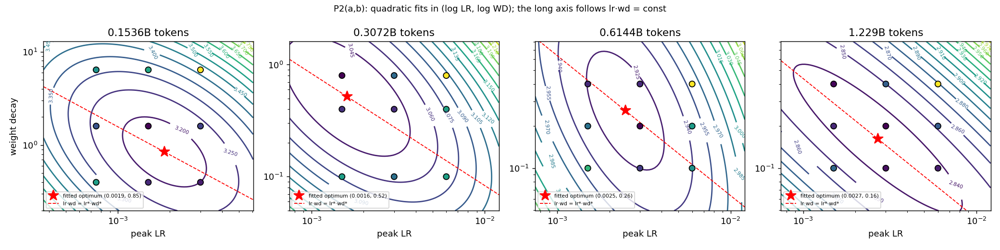
*Figure 2. Quadratic fits per budget on log–log axes; dots = supplied runs (colour = loss), star = fitted optimum, dashed line = lr·wd = lr\*·wd\*. The long axis of every ellipse runs along the dashed line.*

The optimal learning rate wanders (0.0019 → 0.0016 → 0.0025 → 0.0027), like in Problem 1; the optimal weight decay falls steadily (0.85 → 0.16, 5× over 8× tokens). The benefit of tuning weight decay shrinks from 0.045 at 153.6M to 0.002 (noise) at 1.2B (Figure 3, right).

### (b) From coupling to a joint scaling law

| quantity | power law in tokens | R² |
|---|---|---|
| lr\* | ∝ D^+0.22 | 0.68 |
| wd\* | ∝ D^−0.82 | 0.994 |
| lr\*·wd\* | ∝ D^−0.59 | 0.967 |

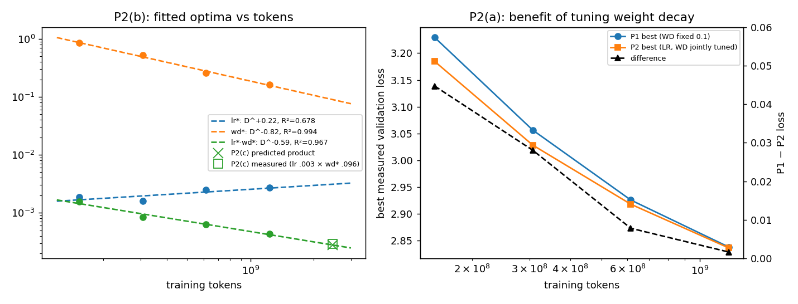
*Figure 3. Left: fitted lr\*, wd\*, and their product vs tokens with power laws; the P2(c) prediction (×) and the measured optimum at 2.4576B (□). Right: best measured loss with WD fixed at 0.1 (P1) vs jointly tuned (P2), and the difference.*

Yes, one hyperparameter compensates for the other: on every contour plot the valley runs along lr·wd = constant, so raising one and lowering the other by the same factor barely changes the loss, while moving across that line changes it a lot. The product has a tight law (R² 0.97); weight decay alone is tighter still here (0.994), but mainly because the learning rate was nearly constant across these budgets. The product is the quantity with a physical meaning: with AdamW the weights shrink by (1 − lr·wd) per step, so 1/(lr·wd) is the averaging window in updates.

### (c) Test of the joint rule at 2.4576B tokens (5 new runs)

Product law on the four source budgets predicts lr\*·wd\* = 2.78·10⁻⁴ at 2.4576B, so at peak LR 0.003 the **predicted weight decay is 0.0927**.

| lr | wd | lr·wd | val loss | gap to prediction |
|---|---|---|---|---|
| 0.0015 | 1.6 — baseline (i): best 153.6M pair, untuned | 2.4e-3 | 2.8517 | +0.084 |
| 0.003 | 0.05 | 1.5e-4 | 2.7715 | +0.004 |
| **0.003** | **0.0927 (prediction)** | 2.8e-4 | **2.7680** | — |
| 0.003 | 0.1 — baseline (ii) grid best | 3.0e-4 | 2.7671 | −0.001 |
| 0.003 | 0.2 | 6.0e-4 | 2.7725 | +0.005 |

Quadratic in log wd at lr 0.003: wd\* = 0.096, loss 2.7675. The prediction is within noise of the tuned grid best (−0.001) and 0.084 better than carrying the small-budget pair.

**Synthesis.** The product rule is an effective recipe: hold the learning rate anywhere in its flat region and set wd = (predicted product)/lr. The loss valley is long and narrow along the product direction, so fixing one coordinate and solving for the other loses nothing. The product falls like D^−0.6, so the averaging window in steps grows like D^0.6 — slower than the run length — and the weight-decay benefit shrinks with budget because at large budgets the default 0.1 is already near the optimum. The real lesson is baseline (i): a weight decay of 1.6 that was right at 153.6M tokens is 17× too large at 2.5B and costs 0.084, far more than any learning-rate mistake in Problem 1.

---

## Problem 3.1 — What does the noisy quadratic model predict about batch size? (CPU)

Setup: f(w) = ½ wᵀHw, H = diag(1, 10), gradient-noise covariance σ²I, w₀ ~ N(0,1) ⊕ N(0, 0.1), N = 8192 samples per epoch so updates = N/B, 1024 Monte-Carlo samples per loss estimate. Source batches 1–64, fit lr\* ∝ B^p, predict B = 256, test with a sweep at 256.

### (a)–(b) Scaling exponent by optimizer (σ = 1)

| optimizer | exponent p (B 1–64) | predicted lr\*(256) | measured lr\*(256) | loss at predicted | tuned loss | gap |
|---|---|---|---|---|---|---|
| SGD | 0.99 | 0.184 | 0.123 | 0.00237 | 0.00073 | +0.0016 |
| RMSProp | 0.90 | 0.113 | 0.094 | 0.0151 | 0.0121 | +0.0031 |
| Adam | 0.92 | 0.125 | 0.156 | 0.0149 | 0.0144 | +0.0005 |

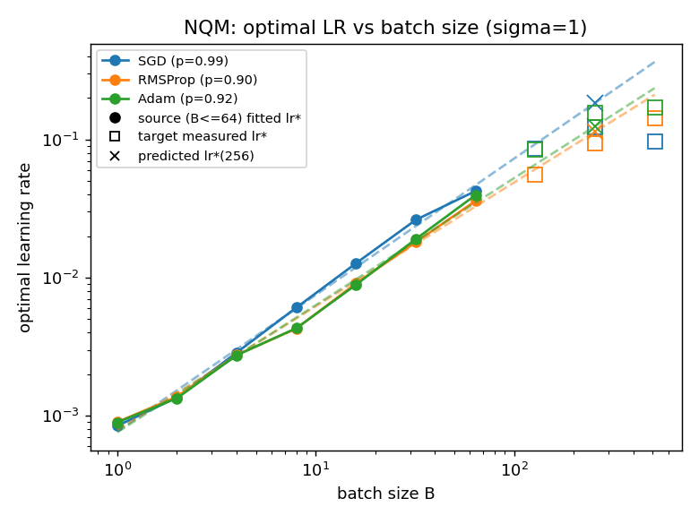
*Figure 4. Optimal LR vs batch for SGD, RMSProp, Adam (σ = 1): source fits (dots, dashed), prediction at 256 (×), measured optimum (□).*

All three scale almost linearly with batch at low noise. The SGD rule breaks exactly where expected: the predicted 0.184 is at the stability edge of the stiff direction (lr < 2/10 = 0.2), so the measured optimum backs off to 0.123. Adam and RMSProp have similar exponents but Adam transfers better (gap 0.0005 vs 0.0031) — same exponent, different curve width, so a similar exponent does not imply similar transfer accuracy. Tuned SGD loss by batch: 0.00037 (B 1) → 0.00032 (B 8–16) → 0.00039 (B 64) → 0.00073 (B 256): best at B ≈ 8–16, then worse, because at fixed N the number of updates is what you pay with and B = 256 leaves 32. The rule holds while noise dominates the error; once the budget is a handful of steps the stability ceiling and the step count take over.

**Prediction for the language model (made before P3.2):** optimal LR rises with batch, close to linearly from batch 8 to 64, flattening by 128–256 where per-step noise stops being the bottleneck.

### (c) Noise level

| σ | RMSProp exponent (2-D) | Adam exponent (2-D) | RMSProp (scalar f = w²/2) | Adam (scalar) |
|---|---|---|---|---|
| 1 | 0.91 | 0.92 | 0.94 | 0.93 |
| 10 | 0.55 | 0.54 | 0.57 | 0.55 |
| 100 | 0.45 | 0.49 | 0.50 | 0.48 |
| 300 | 0.53 | 0.49 | 0.40 | 0.45 |

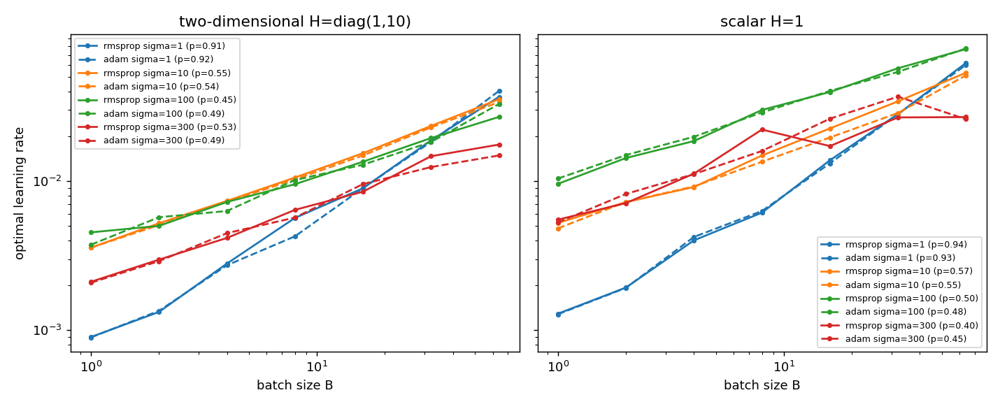
*Figure 5. Optimal LR vs batch by noise level for the 2-D (left) and scalar (right) models; exponents in the legend.*

Yes, signal-to-noise changes the rule. The second moment is v ≈ g² + σ²/B. When the gradient dominates, v is batch-independent and g/√v behaves like SGD, so lr\* ∝ B. When noise dominates, √v ∝ σ/√B already scales the update by √B and the learning rate only needs to supply another √B — exponent ½. The 2-D and scalar models agree, so this is a property of second-moment normalisation, not curvature. What is curvature-sensitive is where the linear rule breaks: the stiff direction imposes lr < 2/λ_max in 2-D, and the scalar model has no such ceiling.

### (d) Momentum at small and large batch

| setting | B = 16 (512 updates): lr\* → loss | B = 256 (32 updates): lr\* → loss |
|---|---|---|
| SGD, µ = 0 | 0.0126 → 0.00035 | 0.124 → 0.00067 |
| SGD, µ = 0.9 | 0.00127 → 0.00032 | 0.0083 → 0.0041 |
| Adam, β₁ = 0 | 0.0089 → 0.00104 | 0.093 → 0.0123 |
| Adam, β₁ = 0.5 | 0.0089 → 0.00082 | 0.133 → 0.0035 |
| Adam, β₁ = 0.9 | 0.0090 → 0.00083 | 0.156 → 0.0143 |
| Adam, β₁ = 0.95 | 0.0090 → 0.00094 | 0.188 → 0.050 |
| Adam, β₁ = 0.99 | 0.018 → 0.0127 | 0.064 → 0.134 |

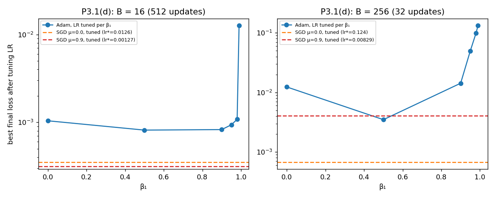
*Figure 6. Best loss after tuning LR at each β₁, with tuned SGD with/without momentum as reference lines.*

Momentum is mildly helpful at small batch (SGD 0.00035 → 0.00032; Adam β₁ 0.5–0.9 beat β₁ = 0 by 20 %) and harmful at large batch even after retuning the LR (SGD µ = 0.9 is 6× worse; Adam β₁ ≥ 0.9 is worse than 0.5). The tuned SGD lr\* drops 15× with momentum at B = 256 (0.124 → 0.0083): the effective step lr/(1−µ) must be cut because the stiff direction overshoots.

**Synthesis.** Momentum averages gradients over ≈1/(1−β₁) updates. That is noise reduction, which is also what a bigger batch does, so the benefit shrinks with batch; the cost is lag, and at B = 256 a β₁ = 0.9 window (≈10 updates) is a third of the 32-update run. **Expectation for the language model:** β₁ = 0.9 should help slightly at batch 8 and matter little at batch 256, because the LM run has thousands of updates, not 32, so the lag cost should not appear. (Tested in P3.2(c) — this expectation turned out half right.)

---

## Problem 3.2 — What should scale when batch size changes? (language model)

Setup: d8 model, 614.4M tokens, AdamW, 1 % warmup then linear decay, microbatch min(B, 64). 15 new source runs at batch 8/16/32 (3 LRs at wd 0.1, plus wd 0.05 and 0.2 at lr 0.0015), reusing the supplied batch-64 curves from Problems 1–2 as the fourth source. Then, with predictions written down first, 13 target runs at batch 128/256 (trimmed to 4 points per curve) and 6 β₁ controls. One run per point.

### (a) Optimal learning rate and loss vs batch size (weight decay 0.1)

| batch | LRs tried | best sampled | fitted lr\* | loss at lr\* | updates | run time |
|---|---|---|---|---|---|---|
| 8 | 0.0004 / 0.00075 / 0.0015 | 0.0015 | 0.00109 | 2.934 | 75,000 | 16 min |
| 16 | 0.00075 / 0.0015 / 0.003 | 0.0015 | 0.00174 | 2.922 | 37,500 | 13 min |
| 32 | 0.0015 / 0.003 / 0.006 | 0.003 | 0.00329 | 2.919 | 18,750 | 12 min |
| 64 (supplied) | 0.0015 / 0.003 / 0.006 | 0.003 | 0.00319 | 2.925 | 9,375 | — |

Source fit: lr\* ≈ 0.00037 · B^0.56. The optimum rises roughly like √B from 8 to 32 — not linearly as the low-noise NQM predicted, and not flat — then stops between 32 and 64. Best loss is indifferent to batch between 16 and 64 (2.92 ± 0.003); batch 8 is 0.012 worse despite 75,000 updates, so that penalty is "too few tokens per update", not "too few updates".

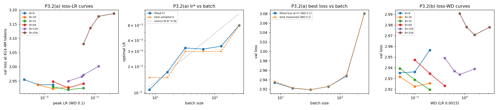
*Figure 7. Left to right: loss–LR curves at wd 0.1 for all batches (targets included); fitted and best-sampled lr\* vs batch with the source B^0.56 law; best loss vs batch at wd 0.1; loss–WD curves at lr 0.0015.*

### (b) Two scaling hypotheses: scale LR at fixed WD, or scale WD at fixed LR 0.0015

Source side at lr 0.0015:

| batch | WDs tried | best sampled wd | fitted wd\* |
|---|---|---|---|
| 8 | 0.05 / 0.1 / 0.2 | 0.05 | 0.068 |
| 16 | 0.05 / 0.1 / 0.2 | 0.1 | 0.12 |
| 32 | 0.05 / 0.1 / 0.2 | 0.2 | ≥ 0.2 (grid edge) |
| 64 (supplied) | 0.1 / 0.2 / 0.4 | 0.4 | ≥ 0.4 (grid edge) |

The weight-decay optimum roughly doubles with each batch doubling. Two source optima sit on the grid edge, so the exponent is poorly determined: the interior fit gives wd\* ∝ B^0.80 (0.63 at 128, 1.1 at 256); a proportional rule gives 0.95 and 1.9. We used the interior fit for the predicted point and bracketed it.

**Predictions recorded before launch:** hypothesis i (wd 0.1): lr 0.0056 at B = 128, 0.0082 at B = 256; hypothesis ii (lr 0.0015): wd 0.63 at 128, 1.1 at 256. **We predicted hypothesis i would win**, reasoning that scaling the LR keeps the per-update step matched to the lower gradient noise while hypothesis ii keeps a small step and compensates with a decay so strong (window of 500–1,000 updates out of 2,300–4,700) that it erases learning.

| target batch | hypothesis i, wd 0.1: lr → loss | hypothesis ii, lr 0.0015: wd → loss |
|---|---|---|
| 128 (4,688 updates) | 0.003 → **2.949** · 0.0056 (pred) → 2.965 · 0.006 → 2.971 · 0.012 → 3.002 | 0.4 → 2.949 · 0.63 (pred) → 2.937 · 0.8 → **2.934** · 1.6 → 2.939 |
| 256 (2,344 updates) | 0.006 → **3.080** · 0.0082 (pred) → 3.136 · 0.012 → 3.178 · 0.024 → 3.187 | 0.8 → 2.991 · 1.1 (pred) → 2.978 · 1.6 → **2.971** · 3.2 → 2.978 |

**Hypothesis ii wins at both targets: 2.934 vs 2.949 at batch 128 (0.015), 2.971 vs 3.080 at batch 256 (0.11). Our prediction was wrong.** Three reasons:

1. The LR optimum stopped rising. B^0.56 from 8 to 32; flat from 32 to 64 (0.0033 → 0.0032); 0.0034 again at 128; at 256 the best point is the *lowest* LR tried. Extrapolating the source law to 0.0056/0.0082 overshot, and the loss curve is steep on the high side (0.012 at batch 256 costs 0.1).
2. At fixed wd 0.1, large batches simply lose: the best batch-256 point (3.080) is 0.16 worse than batch 32. With 2,344 updates instead of 18,750, a fixed per-update decay is an 8× longer memory in tokens — the model carries early, badly-fitted weights to the end.
3. The WD optimum doubled every time the batch doubled: best sampled 0.1 (16), 0.2 (32), 0.4 (64), 0.8 (128), 1.6 (256); fitted target optima 0.95 and 1.88 — wd\* ∝ B. The proportional rule (0.95 / 1.91) was right to 2 %; the interior power law undershot because two of its four points were lower bounds. Scaling wd ∝ B keeps lr·wd·(updates per token) — the decay timescale in *tokens* — constant, the same quantity Problem 2 found mattered.

Even with the right weight decay, batch 256 is 0.05 worse than batch 32 at this token budget (2.971 vs 2.919), and batch 128 is 0.015 worse: fewer updates cannot be fully bought back by either knob. This agrees with the NQM only in the small-batch range (exponent ≈ ½ matches its *high-noise* regime); the NQM has no critical batch size and no weight decay, so it cannot predict the flattening or the wd ∝ B rule.

### (c) Momentum ablation

Held fixed: each batch's best measured pair (batch 8: lr 0.0015, wd 0.05; batch 256: lr 0.0015, wd 1.6), β₂ = 0.95, 614.4M tokens. Trimmed to β₁ ∈ {0, 0.5, 0.98} plus the existing β₁ = 0.9 run.

| β₁ | batch 8 (75,000 updates) | batch 256 (2,344 updates) |
|---|---|---|
| 0 (no momentum) | 2.978 | 3.198 |
| 0.5 | 2.963 | 3.060 |
| 0.9 (tuned runs) | **2.935** | **2.971** |
| 0.98 | 2.934 | 3.025 |
| cost of removing momentum (0.9 → 0) | +0.043 | +0.228 |

**Momentum matters *more* at large batch, not less — the opposite of the NQM's call.** Dropping β₁ to 0 costs 0.04 at batch 8 and 0.23 at batch 256 (5×). Raising it to 0.98 is free at batch 8 (2.934 vs 2.935) but costs 0.054 at batch 256, so at large batch the optimum is pinned near 0.9 from both sides. Compared with P3.1(d), where we retuned the LR per β₁: here the LR is held at the β₁ = 0.9 optimum, so the β₁ = 0 runs may be slightly under-tuned, but the size of the gap (0.23) is far beyond anything a retune could recover given the P3.2(a) curve shape at batch 256.

Reading (interpretation, not a measured mechanism): the NQM's "momentum hurts at large batch" was lag in a 32-update run where a β₁ = 0.9 window is a third of training. The LM at batch 256 has 2,344 updates, so that lag is negligible at 0.9 and only reappears at 0.98 (≈50-update window = 2 % of the run, cost 0.054). What is left is the benefit: Adam with β₁ = 0 is RMSProp, every coordinate moves ≈lr per update regardless of signal-to-noise; at batch 8 the 75,000 small steps under a long decaying schedule average that noise out on their own, while at batch 256 each of 2,344 steps is 32× more consequential and momentum is the only remaining noise reduction.

### (d) What does the NQM explain?

| quantity | NQM prediction (P3.1) | language model (P3.2) | verdict |
|---|---|---|---|
| lr\* vs batch, low noise | ∝ B^0.9–1.0 | ∝ B^0.56 for 8→32, then flat, then *lower* at 128–256 (0.003 → 2.949 beats 0.0056 → 2.965; 0.006 → 3.080 beats 0.0082 → 3.136) | **fails** above batch ≈ 32: the NQM has no critical batch size where more sequences per update stop reducing useful noise |
| lr\* vs batch, high noise | ∝ B^0.5 | B^0.56 in the small-batch range | agrees where the LM is noise-limited |
| best loss vs batch | at fixed N: bigger batch better until the stability/step-count ceiling (B ≈ 8–16 best) | fixed tokens: 2.934 (8) → 2.919 (32) → 2.925 (64) → 2.934 (128, retuned wd) → 2.971 (256, retuned wd) | qualitatively agrees: an interior best batch, penalty from the update count beyond it |
| weight decay vs batch | not modelled | wd\* ∝ B, 0.1 → 1.6 over 16 → 256; keeping wd fixed costs 0.11 at batch 256 | **an effect the NQM does not model**, not a failed prediction |
| momentum (β₁) | helps slightly at small batch, hurts at large batch even with LR retuned | 0.9 → 0 costs 0.043 at batch 8 and 0.228 at batch 256; 0.98 ≈ 0.9 at batch 8 but costs 0.054 at batch 256 | small-batch half agrees; **large-batch half fails** — the NQM's harm was lag in a 32-update run |

**Synthesis.** Two currencies: tokens (what you pay for) and updates (what moves the weights); doubling the batch halves updates per token, and every hyperparameter defined per update needs rescaling. The learning rate is per update but is capped by curvature once noise stops being the limit — a critical batch size around 32–64 here — which the NQM's low-noise regime lacks because its noise never stops averaging down. Weight decay is also per update: 1/(lr·wd) updates of memory, so keeping it fixed while halving updates per token doubles the memory in tokens; wd\* ∝ B is "keep the memory constant in tokens", the Problem 2 product rule with batch as the third factor. **One change to the NQM** that would fix the biggest disagreement: add a per-coordinate noise floor that does not shrink with batch (equivalently, a finite number of useful directions), so gradient-noise reduction saturates, the optimal step stops growing past a critical batch, and fixed-token loss worsens beyond it. Adding an L2 term with a timescale in updates would also reproduce wd\* ∝ B. Practical rule for this model: when changing batch size at fixed tokens, keep the LR near its batch-32–64 value, scale weight decay in proportion to the batch, keep β₁ = 0.9, and expect a loss penalty at batch ≥ 128 anyway.

---

## Problem 4.0 — Scaling rules from alignment assumptions

Setup: width n, reference n₀, m = n/n₀. Each matrix is used as n^−a·W, initialised with i.i.d. entries of variance n^−2b, updated by ΔW = −η·n^−c·U with ‖U‖_RMS = Θ(1). a = 0 for hidden/input, c = 0 for readout. Alignment ratios: R(U, x₀) = Θ(n^α), α = 1 if the update direction is aligned with its input (n terms add coherently), ½ if not (random-walk sum); S(V₀, Δx) = Θ(n^ω), ω = 1 aligned, ½ not. Assume R(U, Δx) = O(n^α).

### (a) Constraints

**Hidden (a = 0, fan-in k = n).** Order-one features at init: ‖Wx₀‖ ~ √n · n^−b = Θ(1) ⇒ b = ½ (variance 1/k), independent of alignment. Order-one direct update: ‖ΔW x₀‖ = η n^−c R(U, x₀) = η n^(α−c) = Θ(1) ⇒ c = α. Interaction: ‖ΔW Δx‖ = O(n^(α−c)) = O(1), bounded automatically.

**Readout (c = 0, transposed V₀ ∈ ℝ^(n×q), response n^−a V^T x).** Direct update: η n^(α−a) = Θ(1) ⇒ a = α. Initial-readout response to the feature change: n^−a S(V₀, Δx) n^−b = n^(ω−a−b) = Θ(1) ⇒ b = ω − α. Interaction η n^(α−a) = O(1), bounded.

**Input / embedding (fixed fan-in: a token hits one column, no sum over n).** Order-one features ⇒ b = 0 (variance 1). Order-one update ‖ΔW e_j‖ = η n^−c ⇒ c = 0. Alignment plays no role.

| alignment (α, ω) | hidden (a, b, c) | readout (a, b, c) | input (a, b, c) |
|---|---|---|---|
| update aligned, readout aligned (1, 1) | (0, ½, 1) | (1, 0, 0) | (0, 0, 0) |
| update aligned, readout not (1, ½) | (0, ½, 1) | (1, −½, 0) | (0, 0, 0) |
| update not aligned, readout aligned (½, 1) | (0, ½, ½) | (½, ½, 0) | (0, 0, 0) |
| neither aligned (½, ½) | (0, ½, ½) | (½, 0, 0) | (0, 0, 0) |

### (b) Rules in m = n/n₀

Matching the table at n₀: forward multiplier m^−a, init variance σ₀² m^−2b, learning rate η m^−c.

| layer | forward multiplier | init variance | LR |
|---|---|---|---|
| hidden | 1 | 1/k | η · m^−α |
| readout | m^−α | n₀^−1 · m^−2(ω−α) | η |
| embedding | 1 | 1 | η |

Update alignment α sets how fast hidden LRs shrink (1/m aligned, 1/√m not) and how strongly the readout is damped (1/m vs 1/√m). Readout alignment ω only changes the readout initialisation: with ω = α the variance is width-independent (1/n₀); with ω < α it would have to *grow* with width (m^+1), the signal that "aligned updates, unaligned readout" is not a consistent regime. The interaction terms are O(n^(α−c)) and O(n^(α−a)), bounded in every row once the direct-update constraint holds.

**µP is (α, ω) = (1, 1):** hidden variance 1/k and LR η/m; readout variance 1/n₀, multiplier 1/m, LR η; embedding variance 1, LR η — exactly the P4.2 µP column (G/n₀, G/√n₀, 1/m, η/m at n₀ = 512). **Kaiming** keeps readout (0, ½, 0) and hidden c = 0: its readout satisfies a + b = ½ = ω only for an unaligned readout, and with aligned Adam updates its first step moves features by Θ(n) at fixed η, so its tuned base LR must fall like 1/n. That is the prediction P4.1 tests.

---

## Problem 4.1 — Five-step Transformer stress test

Five Adam updates, constant LR, no warmup, no weight decay, same five batches for every configuration; fixed probe inputs for all measurements.

### (a) Width transfer (36 runs; depth 2, reference width 512, FP32)

Six LRs per cell (0.00025 … 0.008, doubling), plus 0.0000625 and 0.000125 for wide Kaiming once its optimum fell off the grid. **Prediction before running:** Kaiming's best base LR falls like 1/width (≈0.00025 at 2560, ≈0.000125 at 5120); µP's stays near its width-640 value.

| policy | width | best sampled lr | fitted lr\* | loss at best | loss at lr 0.00025 | at 0.002 | at 0.008 |
|---|---|---|---|---|---|---|---|
| Kaiming | 640 | 0.001 | 0.0011 | 7.069 | 7.885 | 7.098 | 8.336 |
| Kaiming | 2560 | 0.000125 | 0.00015 | 7.184 | 7.245 | 9.235 | 15.39 |
| Kaiming | 5120 | 0.0000625 (grid edge) | ≤ 0.0000625 | 7.325 | 8.049 | 11.13 | 21.46 |
| µP | 640 | 0.002 | 0.0015 | 6.784 | 8.006 | 6.784 | 8.015 |
| µP | 2560 | 0.002 | 0.0013 | 6.669 | 7.710 | 6.669 | 8.127 |
| µP | 5120 | 0.002 | 0.0012 | 6.700 | 7.655 | 6.700 | 7.968 |

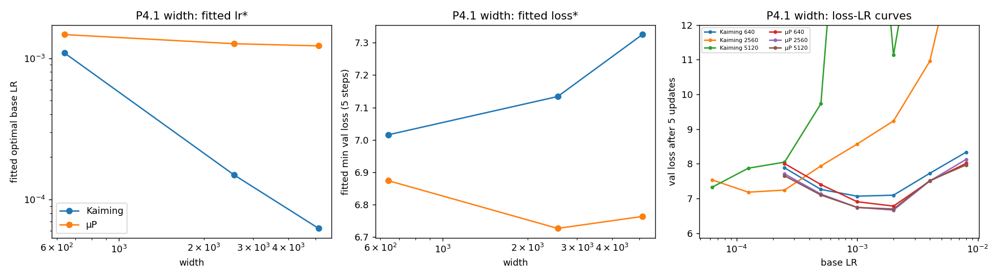
*Figure 8. Fitted optimal base LR (left) and fitted minimum five-step loss (middle) vs width; loss–LR curves (right).*

Both predictions held, and Kaiming fell slightly *faster* than 1/width (7× from 640 to 2560, ≥16× at 5120; at 5120 the width-640 optimum 0.001 gives loss 22.8). µP's best sampled LR is 0.002 at every width and its fitted optimum moves 20 % over 8× width. **µP transfers its tuned base LR; Kaiming does not. µP also reaches the lower loss at every width** (6.78 / 6.67 / 6.70 vs 7.07 / 7.18 / 7.33), improving with width while Kaiming worsens.

### (b) Width probes (at each configuration's best sampled LR)

| policy | width | logit RMS step 0 → 5 | final-norm feature movement M₅ | ω_move | α_upd hidden q/k/v/gate/up/down (step 1 → 5) | α_upd attention-out / readout |
|---|---|---|---|---|---|---|
| Kaiming | 640 | 1.00 → 1.26 | 1.07 | 0.501–0.507 | 0.59–0.64 → 0.64–0.88 | 0.79–0.82 / 0.63 → 0.92 |
| Kaiming | 2560 | 1.00 → 1.23 | 0.85 | 0.512–0.519 | 0.65–0.70 → 0.69–0.74 | 0.83 / 0.69 |
| Kaiming | 5120 | 1.00 → 1.33 | 1.08 | 0.516–0.528 | — | 0.85–0.87 / 0.71 → 0.89 |
| µP | 640 | 0.89 → 1.61 | 1.12 | 0.500–0.506 | 0.59–0.64 → 0.65–0.92 | 0.79–0.82 / 0.63 → 0.92 |
| µP | 2560 | 0.45 → 1.45 | 1.02 | 0.514–0.517 | — | 0.83–0.85 / 0.68 → 0.93 |

Residual-stream RMS before the final norm grows from 1 to 3.1–3.9 in every case; normalised features stay at RMS 1.00.

1. **Tuned = order-one feature movement.** At the best LR the final normalised features have moved by RMS ≈ 1 after five steps in every configuration — the derivation's definition of a correct step size. µP produces it at the same base LR at every width; Kaiming needs a smaller base LR as width grows because its hidden updates move features by Θ(width).
2. **Logit RMS at init.** Kaiming's 1/n readout variance gives RMS 1 at every width; µP's (variance 1/n₀, multiplier 1/m) gives 1/√m: 0.89 at 640, 0.45 at 2560. After five updates both reach 1.2–1.6, so in µP the learned part of the readout carries the signal.
3. **Update alignment is partial, not full.** α_upd is 0.59–0.70 at step 1 for q/k/v/gate/up/down, higher (0.79–0.87) for the attention output projection, rising to 0.7–0.95 by step 5. Adam updates are far more aligned than random (½) but not fully coherent (1). The η/m rule still transferred because slightly over-shrinking the hidden LR only shifts the optimum within the flat region — the 20 % drift we see.
4. **Readout–feature-change alignment is at the no-alignment scale.** ω_move = 0.50–0.53 everywhere, against µP's assumed ω = 1. So V₀ᵀΔx scales like m^(ω−α−b) = m^−½ under µP's init: a bounded, vanishing contribution — which is exactly why µP's initial logits shrink with width and the learned readout takes over. The assumption that fails is one the LR rule did not actually need.

### (c) Depth transfer (63 runs; width 64, one head, reference depth 2, mixed precision)

Nine LRs per cell (0.00025 … 0.064, doubling), all on top of the µP width rule, r = depth/2.

| prescription | residual-branch multiplier | hidden LR multiplier | Adam ε multiplier |
|---|---|---|---|
| µP (no depth rule) | 1 | 1 | 1 |
| Depth-µP | r^−½ | r^−½ | r^−½ |
| CompleteP | 1/r | 1 | 1/r |

**Prediction before running:** CompleteP transfers best, Depth-µP next, plain µP worst, because only CompleteP keeps each block's contribution to the residual stream depth-independent.

| prescription | depth | best sampled lr | fitted lr\* | loss at best | loss at lr 0.008 | loss at lr 0.032 |
|---|---|---|---|---|---|---|
| µP | 2 (same model for all three) | 0.016 | 0.0174 | 6.858 | 7.216 | 7.119 |
| µP | 100 | 0.016 | 0.0146 | 7.060 | 7.270 | 7.135 |
| µP | 1000 | 0.016 | 0.0138 | 7.067 | 7.322 | 7.281 |
| Depth-µP | 100 | 0.016 | 0.0197 | 6.867 | 7.260 | 7.107 |
| Depth-µP | 1000 | 0.016 | 0.0170 | 6.951 | 7.151 | 7.028 |
| CompleteP | 100 | 0.016 | 0.0179 | 6.816 | 7.209 | 7.065 |
| CompleteP | 1000 | 0.016 | 0.0158 | 6.863 | 7.220 | 7.271 |

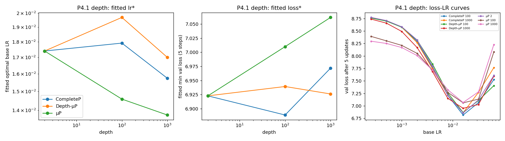
*Figure 9. Fitted optimal base LR and fitted minimum loss vs depth for the three prescriptions; loss–LR curves (right).*

At the resolution of a doubling grid all three prescriptions transfer the base LR from depth 2 to 1000 (best sampled 0.016 in every cell). Fitted optima drift down 21 % (µP), 14 % (Depth-µP), 12 % (CompleteP) over 500× depth — the predicted ranking, but small differences. **Loss is where they separate:** plain µP's tuned loss worsens with depth (6.86 → 7.06 → 7.07) while Depth-µP (6.87 → 6.95) and CompleteP (6.82 → 6.86) stay near the depth-2 value, CompleteP best at both depths. Better transfer does come with lower loss, but the loss gap (0.2) is much larger than the transfer gap (a few percent of LR): the depth rules matter more for what the deep model can do in five steps than for where its optimum sits.

### (d) Depth probes (best sampled LR 0.016, plus 0.008)

| prescription | depth | residual-stream RMS before final norm | branch-output RMS, last block (attn / MLP) | normalised feature movement M₅ | ω_move |
|---|---|---|---|---|---|
| µP | 2 | 9.6 | 4.3 / 4.4 | 1.1 | 0.50 |
| µP | 100 | 696 (235 at lr 0.008) | 3.4 / 6.7 | 1.2 | 0.50 |
| µP | 1000 | 6378 (2400 at lr 0.008) | 3.4 / 6.7 | 1.25 | 0.50 |
| Depth-µP | 1000 | 7.7 (5.0 at lr 0.008) | ≈ 1 | 1.1 | 0.50 |
| CompleteP | 100 | 6.0 | ≈ 1 | 1.1 | 0.50 |
| CompleteP | 1000 | 6.2 (5.9 at lr 0.008) | ≈ 1 | 1.1 | 0.50 |

**Yes, normalised activations hide a growing residual stream.** Plain µP at depth 1000 feeds a residual stream of RMS 6378 into the final RMSNorm, yet the normalised features have RMS 1 and have moved by M₅ ≈ 1.1–1.25, like every other configuration; logits are RMS 1.7–2.0 everywhere. The residual RMS grows roughly linearly in depth (696 → 6378 for 10× depth), not like √depth: after Adam's first update the branch outputs are coherent and add rather than average. Depth-µP (1/√r) bounds the stream at 7.7; CompleteP (1/r) at 6.2, flat between depth 100 and 1000 — bounded signals versus plain µP's nonvanishing, growing one. In plain µP the final norm divides by ≈6000, so each block's order-one contribution is 1/6000 of its depth-2 value: 1000 blocks used as one averaged direction, which is why its loss plateaus at 7.06 while CompleteP's blocks keep individual leverage (6.82–6.86). The LR optimum barely moves for any of them because Adam's per-entry step is what the base LR sets and RMSNorm absorbs the scale; the depth rule changes the *quality* of the step. ω_move is 0.50 at every depth and prescription; hidden α_upd for query matrices is 0.53 at step 1 at shallow depth, but already 0.73–0.80 for plain µP at depth 100–1000 — the coherence from the linear growth showing up directly.

**Synthesis (P4.1).** The derivation's two assumptions fare differently: α = 1 is approximately right (0.6–0.9, rising), ω = 1 is wrong everywhere (0.5). The rules that matter — hidden LR η/m and readout multiplier 1/m — depend on α, so µP transfers; the rule that depends on ω (readout init) only changes whether the initial readout contributes, and it does not. For depth, "transfers the LR" and "keeps the residual stream bounded" are different properties: all three prescriptions have the first over a doubling grid, only Depth-µP and CompleteP have the second, and the second is what sets the loss.

---

## Problem 4.2 — From five updates to a longer training budget

Setup for every new run: 153.6M tokens, batch 64, AdamW β = (0.9, 0.95), weight decay 0.1 (held fixed), seed 42, same data order. Baseline = course default (Kaiming-style, identical to µP at the reference width 512); µP changes only the four table settings with n₀ = 512. The supplied width-512 curve is the source (best sampled LR 0.003, fitted 0.0024).

### (a)–(b) Width transfer (20 new runs, five LRs per cell)

**Prediction before running:** 0.003 transfers to widths 128 and 256 under µP (loss at 0.003 within noise of the tuned loss) but not under the baseline, whose optimum should rise as width shrinks.

| policy | width | best sampled lr | fitted lr\* | tuned loss (fit) | loss at transferred lr 0.003 | gap to best sampled |
|---|---|---|---|---|---|---|
| baseline | 128 | 0.006 | 0.0074 | 3.613 | 3.693 | 0.067 |
| baseline | 256 | 0.003 | 0.0048 | 3.388 | 3.405 | 0 |
| µP | 128 | 0.003 | 0.0037 | 3.628 | 3.628 | 0 |
| µP | 256 | 0.0015 | 0.0025 | 3.406 | 3.419 | 0.006 |
| source (both) | 512 | 0.003 | 0.0024 | 3.224 | 3.229 | 0 |

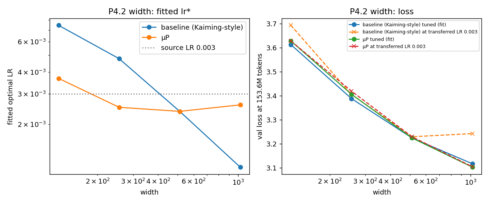
*Figure 10. Fitted optimal LR vs width (left; dotted = source LR 0.003) and tuned vs transferred-LR loss (right), both prescriptions, including the held-out width 1024 from part (c).*

Power laws through the three fitted optima: baseline lr\* ∝ width^−0.82 → 0.0014 at 1024; µP lr\* ∝ width^−0.31 → 0.0018 at 1024 (both recorded before part (c)).

1. **Transfer: µP still wins, less cleanly than in five steps.** From 512 to 128 the baseline optimum moves 3× (0.0024 → 0.0074), µP's 1.5× (→ 0.0037). At the transferred LR the baseline loses 0.067 at width 128; µP loses nothing measurable. But µP's optimum is not flat (exponent −0.31), so over a 4× width change "tune once" is only approximately kept.
2. **Performance: the tuned baseline is slightly better** — 3.613 / 3.388 vs µP's 3.628 / 3.406, ahead by 0.015–0.018 at both widths. In the five-step test µP was ahead by 0.2–0.7.
3. **Why it flips.** In five steps only the size of the first updates mattered. Over 2,444 updates with warmup and decay a 3× mis-sized LR is survivable (the baseline at 0.003 is 0.067 behind its own optimum), and two effects push against µP at *narrow* widths: the 1/m readout multiplier becomes a ×4 boost at width 128 (initial logit RMS 1.96 vs 0.98), and the hidden LR is multiplied by 4 while weight decay stays at 0.1, so the lr·wd product that Problem 2 showed controls the averaging window is 4× the source value. µP transfers the step size but not the regularisation timescale; holding WD fixed is a hidden mis-tuning that grows with the width ratio.

### (c) Held-out width 1024 (8 new runs)

| policy | lr 0.00075 | power-law pick (0.0014 / 0.0018) | lr 0.0015 | lr 0.003 (direct transfer) | fitted lr\* | fitted loss |
|---|---|---|---|---|---|---|
| baseline | 3.139 | **3.114** | 3.135 | 3.242 | 0.0011 | 3.116 |
| µP | 3.240 | 3.111 | 3.124 | **3.104** | 0.0026 | 3.102 |

Gaps to best sampled: baseline — power law 0, direct transfer +0.128; µP — direct transfer 0, power law +0.007. **Fitting the width dependence improves on direct transfer for the baseline (by 0.128) and slightly hurts for µP.** The baseline's optimum moved to a third of the source value, as width^−0.82 said; µP's extrapolated exponent over-corrected because its drift happened at the narrow widths (128, 256), not between 512 and 1024 — consistent with the fixed-WD and α-decay mechanisms being largest when the width ratio is far from 1 in the shrinking direction. Once each is tuned, the two reach the same place (3.114 vs 3.104). Caveat: the baseline's 1024 curve is not smooth at the 0.02 level (0.0014 → 3.114 vs 0.0015 → 3.135, a gap present from step 300 on), so single runs at this width resolve LR differences of ≈0.02 at best; the 0.128 and 0.067 headline gaps stand, the 0.007 µP gap does not.

### (d) Depth transfer at width 512 (18 new runs; reference depth 8, r = depth/8)

| prescription | depth | best sampled lr | fitted lr\* | tuned loss (fit) | loss at transferred lr 0.003 | gap |
|---|---|---|---|---|---|---|
| µP (no depth rule) | 4 | 0.003 | 0.0025 | 3.312 | 3.314 | 0 |
| Depth-µP | 4 | 0.0015 | 0.0016 | 3.326 | 3.344 | 0.018 |
| CompleteP | 4 | 0.003 | 0.0025 | 3.313 | 3.316 | 0 |
| source | 8 | 0.003 | 0.0024 | 3.224 | 3.229 | 0 |
| µP (no depth rule) | 16 | 0.0015 | 0.0021 | 3.167 | 3.175 | 0.002 |
| Depth-µP | 16 | 0.003 | 0.0028 | 3.169 | 3.169 | 0 |
| CompleteP | 16 | 0.0015 | 0.0017 | 3.169 | 3.193 | 0.023 |

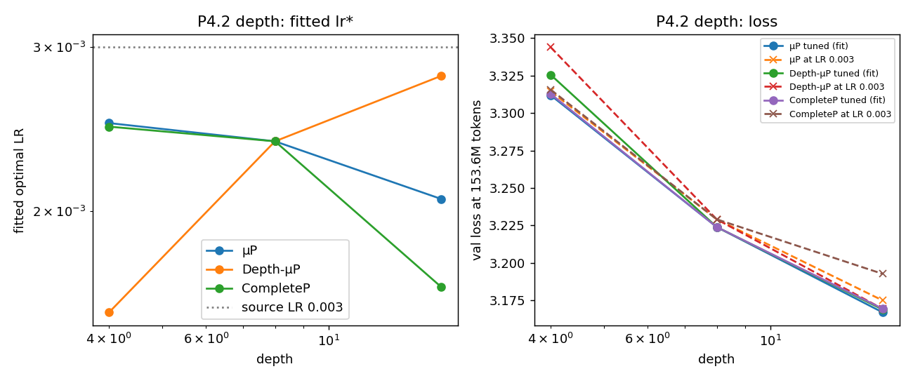
*Figure 11. Fitted optimal LR vs depth (left) and tuned vs transferred-LR loss (right) for µP, Depth-µP, CompleteP at width 512.*

Over a 4× depth range the depth corrections change nothing the data can resolve: tuned losses agree within 0.003 at depth 16 and 0.014 at depth 4 (seed noise 0.002–0.005), and the fitted optima wander between 0.0016 and 0.0028 with no consistent ordering (Depth-µP misses at depth 4, CompleteP at depth 16). With r between ½ and 2 the residual stream grows by at most ≈1.4×, inside what the final RMSNorm and warmup absorb — unlike depth 100–1000 in P4.1. The depth rules are insurance for extreme depth, not a tuning knob at ordinary depth; they improve neither transfer nor tuned loss here.

### (e) Training regime diagnostics (fixed inputs, source LR 0.003)

| configuration | α_upd hidden (median), step 5 → 100 → end | α_upd readout, step 5 → end | ω_move (all steps) | logit RMS, init → end | final-norm feature movement, step 5 → end |
|---|---|---|---|---|---|
| baseline w128 d8 | 0.79 → 0.73 → 0.61 | 0.87 → 0.64 | 0.50 | 0.98 → 4.4 | 1.29 → 2.02 |
| baseline w256 d8 | 0.90 → 0.73 → 0.61 | 0.95 → 0.63 | 0.50 | 0.99 → 4.2 | 1.20 → 1.63 |
| µP w128 d8 | 0.88 → 0.71 → 0.60 | 0.92 → 0.60 | 0.50 | 1.96 → 4.4 | 1.37 → 1.26 |
| µP w256 d8 | 0.91 → 0.74 → 0.61 | 0.94 → 0.62 | 0.50 | 1.40 → 4.2 | 1.25 → 1.22 |
| µP / Depth-µP / CompleteP w512 d16 | 0.91 → 0.77–0.78 → 0.63–0.64 | 0.96 → 0.63 | 0.50 | 0.98 → 4.1–4.3 | 1.30 → 1.34–1.35 |

Gradient clipping (max norm 1) is active only at the start: the step-1 clip coefficient is 0.26 (baseline, width 128) and 0.11 (baseline, width 256) versus 0.034 and 0.040 under µP — µP's larger hidden LR multiplier does not change the first gradient, but its ×m readout multiplier makes the initial gradient 3–8× larger — and it is identical across LRs because the first gradient does not depend on the LR. At every logged point after the first few dozen updates the coefficient is 1 (no clipping) in every configuration, so clipping shapes the first steps and nothing after.

1. **Update alignment decays during training.** α ≈ 0.9 at step 5 (near the derivation's α = 1), 0.73–0.78 at step 100, 0.60–0.64 at the end — only a little above random (½). Early training is a coherent, nearly rank-one push; late training is closer to noise averaging. The η/m rule is derived for α = 1, so it is most exact in the phase the five-step test measured and progressively over-conservative later — consistent with µP's optimum drifting *up* at narrow widths over a full run.
2. **Readout–feature-change alignment never appears:** ω_move = 0.50 at every width, depth, prescription, and step. α = 1 holds early and fails late; ω = 1 holds nowhere. The rules that depend on α still work approximately; the one that depends on ω is irrelevant to the LR.
3. **Transients vs final loss.** µP at width 128 starts with logits twice as large (1.96 vs 0.98) and moves its features further in five steps (1.37 vs 1.29), yet its loss at the transferred LR is *better* (3.628 vs 3.693); the baseline's features end up moving the most (2.02) and it is worst. Larger early transients did not decide the outcome; the step size did.
4. **Does a shifted optimum show the model is outside the stable µP regime? No.** µP's optimum moved 1.5× between widths 512 and 128 while every stability signal stayed bounded (logit RMS grows the same way for all configurations, feature movement 1.2–1.4, smooth flat loss–LR curves). A drifting optimum with bounded diagnostics points to a mis-scaled *secondary* quantity — here the fixed weight decay (Problem 2's coupling: µP multiplies the hidden LR by 1/m but leaves lr·wd unscaled, so the averaging window changes by m) and the decaying α — not to a breakdown of feature learning.

**Synthesis (P4.2).** Transfer a learning rate *upward* in width with µP as-is (0.003 was the best point at 1024); transfer it with a standard parameterisation only through a fitted power law (direct transfer cost 0.128). After tuning, the two reach the same loss to within 0.01–0.02, so over a real budget µP buys predictability, not performance — the opposite emphasis from the five-step test, where it bought both. Depth corrections are irrelevant at depths 4–16. And whenever the width ratio exceeds ≈2×, revisit weight decay: the lr·wd timescale is the one quantity none of these prescriptions preserves, and it is the most likely cause of µP's residual optimum drift at narrow widths.
